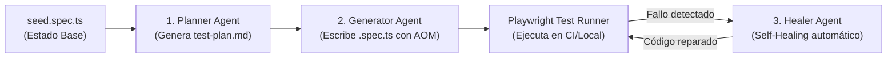

# Guía Docente: E2E Testing e IA Agéntica

**Sesión:** Testing 2: Automated Tests y QA  
**Audiencia:** Desarrolladores y Arquitectos Frontend Senior  
**Rama de trabajo:** `sesion-e2e/01-playwright-mcp` (derivada de `buscar-candidatos-clase/07-pr`)  
**Presentación:** [Google Slides](https://docs.google.com/presentation/d/1IiT9moRBj6Ido7ClOtOibWKaO9E3sdYvQ4-srmrN_J8/edit?usp=sharing)

---

## 1. Tesis de la Sesión: Diseñar para Lograr Éxito en E2E con IA

Un test E2E generado por IA que "pasa en verde" en una demo rápida suele ser una trampa en proyectos de producción:
- Utiliza selectores CSS frágiles (`.css-1a2b > div:nth-child(2)`) que se rompen al mínimo refactor.
- Valida obviedades (happy path superficial) y omite casos de borde o fallos.
- Alucina aserciones porque no comprende el estado real de la aplicación.

**El objetivo de esta sesión es enseñar un método de ingeniería estructurado en 2 partes y 5 fases:**

```
PARTE 1: Fundamentos y Configuración MCP (AOM + Antigravity)
1. Preparar el Repo  ──> 2. Dar Contexto  ──> 3. Fijar Harness  ──> 4. Generar con Agente  ──> 5. Verificar con Criterio
 (AOM y Semántica)       (Contratos & UI)       (MCP & Políticas)     (AOM vs Visión)            (Mutación & Traces)

PARTE 2: Industrialización Agéntica con Playwright Test Agents
npx playwright init-agents  ──>  Planner (Plan MD)  ──>  Generator (Code TS)  ──>  Healer (Self-Healing)
```

---

## 2. PARTE 1: Fundamentos y Configuración 1 (Playwright + MCP con Antigravity)

### Fase 1: Preparar el Repo (Semántica y AOM como API para IA)
- **El concepto:** La mejor manera de evitar que la IA alucine con selectores frágiles es **hacer la UI accesible por diseño**.
- **AOM (Accessibility Object Model):** Cuando construimos `CandidateSearch.tsx`, definimos:
  - `<Form.Label htmlFor={id}>Buscar candidatos</Form.Label>`
  - `<Form.Control type="search" role="searchbox" aria-describedby={`${id}-count`} />`
  - `<Button>Limpiar búsqueda</Button>`
  - `<p id={`${id}-count`} aria-live="polite">{visibleCount} de {totalCount} candidatos</p>`
- **Por qué funciona con IA:** El agente no procesa un árbol DOM de 300 líneas de etiquetas `<div>` con clases Bootstrap; procesa un árbol de accesibilidad semántico con 5 nodos clave: `searchbox "Buscar candidatos"`, `button "Limpiar búsqueda"`, y una región `aria-live`. La accesibilidad es el contrato más estable de la interfaz.

### Fase 2: Dar Contexto (Context Engineering)
- No pedirle a la IA: *"Escribe un test E2E para el buscador"*.
- Proveerle:
  1. **Especificación funcional (OpenSpec / criterios):**
     - `BS-01`: Filtrado en tiempo real por nombre de candidato y conteo de resultados.
     - `BS-02`: Estado vacío diferenciado cuando no hay coincidencias.
     - `BS-03`: Botón "Limpiar búsqueda" vacía la consulta y **devuelve el foco al campo**.
     - `BS-04`: Normalización insensible a mayúsculas y acentos/tildes.
  2. **Contrato de datos:** El listado de candidaturas esperado (`José García`, `Alex Demo`, etc.).

### Fase 3: Fijar Reglas y Harness (El Arnés Técnico y MCP)
- **Harness en Playwright:**
  - Prohibir selectores CSS o XPath: `page.locator('.btn-primary')` ❌.
  - Exigir locators accesibles: `page.getByRole()`, `page.getByLabel()`, `page.getByText()` ✅.
  - Estrategia de mocks: Uso de `page.route()` para interceptar el backend cuando se requiera aislamiento determinista y velocidad.
- **Configuración del MCP (`mcp_config.json`):**
  - Exponer `@playwright/mcp@latest` para que Antigravity / Cursor puedan interactuar con el navegador real en vivo mediante stdio.

### Fase 4: Generar con el Agente (Demostración de la Configuración 1)
- Antigravity se conecta por MCP a Chromium.
- Ejecuta `browser_navigate` a `http://localhost:3000/position/1`.
- Ejecuta `browser_snapshot` y extrae el AOM.
- Sintetiza la suite `frontend/e2e-app/candidate-search.spec.ts`.

### Fase 5: Verificar con Criterio (Calidad más allá del "Verde")
- **La trampa del falso verde:** Un test puede pasar porque no está asertando nada relevante o porque el timeout enmascaró una asincronía.
- **Técnica de Mutación de Código (Test Mutation):**
  - Rompemos intencionalmente en `CandidateSearch.tsx`: comentamos `input.current?.focus()`.
  - Ejecutamos el test generado por la IA. Si el test pasa en verde, **el test es defectuoso**. Si el test falla en `expect(searchbox).toBeFocused()`, el test tiene criterio y valor de regresión real.
- **Inspección en Trace Viewer:** Revisar los eventos de acción, red y snapshots en el tiempo.

---

## 3. PARTE 2: Industrialización Oficial: `npx playwright init-agents`

Playwright ha introducido soporte oficial para flujos agénticos nativos a través del comando:

```bash
npx playwright init-agents --loop=<herramienta>
```
Donde `--loop` puede ser `vscode`, `claude`, `codex` u `opencode`.

### ¿Para qué sirve `npx playwright init-agents`?
En lugar de depender de un prompt genérico, Playwright formaliza el ciclo de vida del testing en **tres agentes de IA especializados**, coordinados mediante MCP y definiciones de sistema:



#### 1. Planner Agent (Planificador)
- **Función:** Explora autónomamente la aplicación (o recibe requerimientos de negocio como los criterios BS-01 a BS-04) y genera un **Plan de Pruebas estructurado en Markdown** (`test-plan.md`).
- **Cómo opera:** Utiliza el MCP de Playwright para navegar los flujos y descubrir los caminos críticos, entradas y salidas de la interfaz.

#### 2. Generator Agent (Generador)
- **Función:** Convierte el plan en Markdown en archivos de tests Playwright ejecutables (`.spec.ts`).
- **Verificación en vivo:** No genera código "a ciegas". Durante la generación, interactúa con el navegador real para validar que los locators (`getByRole`) y aserciones existen y funcionan antes de dar por terminado el archivo.

#### 3. Healer Agent (Self-Healing / Auto-reparación)
- **Función:** Diagnostica y **repara automáticamente tests que fallan**.
- **Cómo opera:** Cuando un test falla (por ejemplo, porque un desarrollador cambió el texto de un botón de `"Limpiar búsqueda"` a `"Restablecer filtro"` o cambió una estructura en el layout), el Healer:
  1. Ejecuta el test fallido.
  2. Inspecciona el Trace Viewer y el snapshot del AOM en el punto del fallo.
  3. Identifica la intención original de la prueba.
  4. Modifica el archivo `.spec.ts` con el nuevo locator adecuado sin alterar la lógica de negocio.

### El Rol Crítico del `seed.spec.ts`
`seed.spec.ts` es el **arnés mínimo necesario** que deben proveer los ingenieros humanos:
- Define cómo arrancar la aplicación en un estado limpio y determinista (mocks de API, autenticación, rutas base).
- El Planner y el Generator utilizan este archivo para saber qué fixtures usar y cómo situar el navegador antes de iniciar cualquier exploración.
- En nuestro repositorio, hemos creado [`frontend/e2e-app/seed.spec.ts`](file:///Users/pedrillo/Documents/lidr/AI4Devs-frontend-202606-senior-2/frontend/e2e-app/seed.spec.ts).

---

## 4. Comparativa de las 2 Configuraciones para Seniors

| Dimensión | Configuración 1: Playwright + MCP & Agents | Configuración 2: Visión Multimodal (Midscene) |
| :--- | :--- | :--- |
| **Paradigma** | **Semántico / AOM** (Accessibility Tree) | **Visual / Multimodal** (Set-of-Mark SoM + GPT-4o) |
| **Herramientas** | `@playwright/mcp`, `npx playwright init-agents` | Midscene (`.ai()`, `.aiAssert()`) |
| **Interacción** | Roles ARIA (`searchbox`, `button`, `heading`) | Coordenadas visuales / bounding boxes con marcas |
| **Salida** | Tests TypeScript nativos (cero dependencias de IA en CI) | Ejecución mediada por LLM en tiempo real |
| **Velocidad de ejecución** | Milisegundos por aserción | Varios segundos por llamada a la API multimodal |
| **Coste por ejecución** | **$0** en CI (ejecución local / runner estándar) | **Coste recurrente** en tokens de visión por cada ejecución |
| **Resiliencia** | Inmune a cambios cosméticos de CSS/diseño | Inmune a cambios estructurales de DOM/clases |
| **Casos de uso ideales** | Dashboards, SPAs, formularios, diseño atómico accesible | Canvas, WebGL, juegos, landing pages visuales, apps sin semántica |

---

## 5. Guion Didáctico de la Sesión (120 minutos)

| Tiempo | Bloque | Tema y Actividad |
| :--- | :--- | :--- |
| **00:00 - 00:20** | **Intro & Metodología** | Tesis: Diseñar para lograr éxito en E2E con IA. El framework de 5 fases. |
| **00:20 - 00:40** | **Fase 1: Preparar el Repo** | Inspección de `CandidateSearch.tsx`. AOM vs DOM. Por qué la accesibilidad es la API de la IA. |
| **00:40 - 01:05** | **Fase 2, 3 & 4 (Demo 1)** | Setup de `mcp_config.json`. Antigravity interactúa con la UI viva y genera `candidate-search.spec.ts`. Ejecución con `npm run test:e2e:search`. |
| **01:05 - 01:15** | **Descanso** | Pausa de 10 minutos. |
| **01:15 - 01:40** | **Parte 2: Industrialización** | `npx playwright init-agents`. Explicar la tríada **Planner, Generator y Healer**. El rol de `seed.spec.ts`. Self-healing en acción. |
| **01:40 - 01:55** | **Configuración 2 & Debate** | Midscene y Visión Multimodal (SoM). Comparativa técnica senior (cuándo usar cuál). |
| **01:55 - 02:00** | **Fase 5: Verificar con Criterio** | Test Mutation en vivo: comentar `input.current?.focus()`, ver fallar el test en rojo, restaurar y conclusiones. |

---

## 6. Ajustes Diapositiva por Diapositiva para Google Slides

Accede a tu presentación en [Google Slides](https://docs.google.com/presentation/d/1IiT9moRBj6Ido7ClOtOibWKaO9E3sdYvQ4-srmrN_J8/edit?usp=sharing) y aplica los siguientes ajustes para estructurar la clase en dos partes:

---

### Slide 4: Estrategia de Calidad
- **Título:** Estrategia de Calidad: Diseñar para el Éxito en E2E con IA
- **Contenido visual / Bullets:**
  - El objetivo no es un “pasó en verde” superficial, sino un método de ingeniería reproducible.
  - **Las 5 Fases del Testing Agéntico:**
    1. **Preparar el Repo:** Semántica accesible (AOM) como API para la IA.
    2. **Dar Contexto:** Criterios de aceptación (BS-01 a BS-04) y fixtures conocidas.
    3. **Fijar el Harness:** Servidor MCP, reglas estrictas de locators y mocks.
    4. **Generar con el Agente:** Enfoque Semántico (AOM) vs Visión Multimodal.
    5. **Verificar con Criterio:** Detección de falsos verdes mediante Test Mutation.
- **Notas del orador:**
  > "Muchos equipos cometen el error de pedirle a un LLM que escriba tests sobre un DOM caótico. La IA genera selectores frágiles y tests que pasan por casualidad. Hoy aprenderemos a diseñar el frontend y el arnés para que la IA sea un colaborador de ingeniería confiable."

---

### Slide 6: AOM vs DOM
- **Contenido actual:** DOM (~285 líneas) vs AOM (~15 nodos semánticos).
- **Añadir recuadro destacado inferior:**
  - **¿Cómo se conecta el Agente al AOM?**  
    A través del **Playwright MCP Server**, el agente recibe el árbol de accesibilidad en tiempo real mediante un protocolo estándar (`stdio`), operando sobre `searchbox "Buscar candidatos"` y `button "Limpiar búsqueda"` sin necesidad de selectores CSS frágiles ni visión costosa.

---

### Slide 8: PARTE 1 - Configuración 1: Playwright + MCP Agéntico
*(Reemplazar o reenfocar la diapositiva de Cypress)*
- **Título:** Configuración 1: Playwright + MCP Agéntico (AOM / Antigravity)
- **Subtítulo:** Interacción semántica en vivo y generación autónoma
- **Bullets:**
  - **Model Context Protocol (MCP):** `@playwright/mcp` conecta el LLM directamente al navegador.
  - **Interacción por Roles:** El agente razona con `getByRole('searchbox')`, `getByRole('button')` y regiones `aria-live`.
  - **Generación en Vivo:** El agente explora la aplicación abierta, prueba interacciones y sintetiza código TypeScript nativo.
  - **Producción:** Los tests resultantes son 100% deterministas y se ejecutan en CI sin requerir APIs de IA en runtime.
- **Notas del orador:**
  > "Mostraremos cómo configurar `mcp_config.json` y cómo Antigravity utiliza las herramientas del MCP para navegar, interactuar con el buscador de candidatos y escribir una suite E2E completa."

---

### Slide 9: PARTE 2 - Industrialización: `npx playwright init-agents`
*(Actualizar la diapositiva tradicional de Playwright para presentar el nuevo comando oficial)*
- **Título:** Industrialización Agéntica: `npx playwright init-agents`
- **Subtítulo:** La tríada oficial de agentes autónomos de Playwright
- **Bullets:**
  - **Inicialización:** `npx playwright init-agents --loop=<vscode|claude|codex>`
  - **La Tríada de Agentes:**
    - 🗺️ **Planner:** Explora la UI y genera el plan de pruebas en Markdown (`test-plan.md`).
    - ⚙️ **Generator:** Transforma el plan Markdown en código `.spec.ts` verificando locators en vivo.
    - 🩹 **Healer (Self-Healing):** Diagnostica tests fallidos y auto-repara selectores ante cambios en la UI.
  - **El Arnés `seed.spec.ts`:** El punto de entrada humano que proporciona autenticación y estado determinista para los agentes.
- **Notas del orador:**
  > "Microsoft Playwright ha dado el paso definitivo hacia la IA agéntica. Con `init-agents`, no usamos un prompt genérico, sino un equipo de agentes especializados que planifican, codifican y auto-reparan los tests cuando la UI cambia."

---

### Slide 10: Configuración 2: Testing Multimodal con Visión (Midscene)
- **Título:** Configuración 2: Testing Basado en Visión (Midscene / SoM)
- **Subtítulo:** Set-of-Mark Prompting y modelos multimodales (GPT-4o)
- **Bullets:**
  - **Zero Selectors:** La IA no mira el DOM ni el AOM; mira la pantalla como un usuario humano.
  - **Sintaxis en Lenguaje Natural:** `.ai('buscar candidato "José"')`, `.aiAssert('ver 1 de 3 candidatos')`.
  - **Comparativa de Arquitectura (AOM vs Visión):**
    - *Playwright MCP / Agents:* Velocidad pura, coste $0 en CI, determinista. Ideal para UIs accesibles.
    - *Midscene (Visión):* Mayor latencia y coste en tokens. Ideal para Canvas, UIs heredadas sin semántica o flujos puramente visuales.

---

### Slide 11 (Nueva): Verificar con Criterio: Calidad más allá del Verde
- **Título:** Verificar con Criterio: Calidad más allá del "Verde"
- **Subtítulo:** Cómo evaluar objetivamente los tests generados por IA
- **Bullets:**
  - **El Peligro del Falso Verde:** Tests que pasan porque no asertan nada o enmascaran fallos con esperas infinitas.
  - **Test Mutation en Directo:** Modificar una línea del componente fuente (ej. romper la recuperación de foco) para confirmar que el test falla en rojo.
  - **Trace Viewer:** El post-mortem definitivo para auditar acciones del agente, red y asincronías.
- **Notas del orador:**
  > "Si la IA genera un test y pasa en verde, nuestro trabajo no ha terminado: debemos mutar el código para demostrar que el test realmente protege la funcionalidad frente a regresiones."
