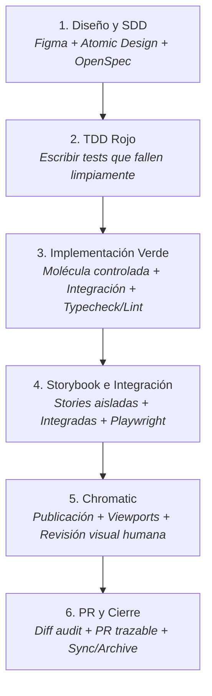

# Workflow de Desarrollo Frontend: SDD, TDD, Storybook y Chromatic

Guía metodológica y operativa paso a paso para el ciclo completo de entrega frontend, independiente de la funcionalidad concreta.

---

## 1. Principios Fundamentales del Flujo

1. **Spec-Driven First (SDD)**: Ninguna línea de código de producción se escribe sin una especificación validada que defina comportamiento observable y contratos formales.
2. **Atomic Design Riguroso**:
   - **Átomos**: Elementos nativos o primitivas de UI (e.g. Bootstrap, Tailwind, diseño base). Sin wrappers innecesarios.
   - **Moléculas**: Componentes visuales puros y controlados. Reciben `props` y emiten eventos. **Prohibido acoplar llamadas HTTP, servicios o lógica de infraestructura** (drag-and-drop global, navegación, etc.).
   - **Organismos / Páginas**: Dueños del estado, ciclo de vida, llamadas a servicios, persistencia, cálculo de estado derivado, identidades inmutables y rollback.
3. **TDD Rojo Auténtico**: Las pruebas deben fallar porque la funcionalidad requerida aún no existe, **nunca** por errores de importación, sintaxis rota o fallos de compilación.
4. **Verificación en Múltiples Capas**:
   - Pruebas unitarias/integración (Jest / React Testing Library).
   - Tipos estáticos (`tsc --noEmit`).
   - Calidad de código (`eslint`).
   - Comportamiento visual e interacción aislada (Storybook + Playwright stories).
   - E2E / Smoke test en navegador real (Playwright app).
5. **Aceptación Visual Humana en Chromatic**: El código de salida `0` del CLI de Chromatic (`--exit-zero-on-changes`) solo indica que la publicación técnica fue exitosa, **no** que los cambios visuales hayan sido aceptados.
6. **Trazabilidad de Cierre**: Todo criterio observable debe enlazarse con su prueba, su story, su snapshot visual y su checkpoint Git antes de fusionar o archivar.

---

## 2. Mapa de Skills por Fase

| Fase | Skills / Capacidades Involucradas | Objetivo Principal |
| :--- | :--- | :--- |
| **1. Diseño y SDD** | `$openspec-propose`<br>`$openspec-explore`<br>`$lti-atomic-design`<br>`$atomic-design-atoms`<br>`$atomic-design-integration` | Definición de contratos, análisis de Figma, redacción de `spec.md`, `design.md` y `tasks.md`. |
| **2. TDD Rojo** | `$openspec-apply-change`<br>Testing CLI (`npm run test:session`) | Creación de tests observables que fallen por lógica ausente, preservando suite previa. |
| **3. Implementación Verde** | `$lti-atomic-design`<br>`$atomic-design-integration`<br>CLI de validación (`typecheck`, `lint`, `test`) | Construcción de moléculas controladas, integración en página y aprobación técnica. |
| **4. Storybook e Integración** | `$storybook`<br>`$storybook-component-documentation`<br>`$modern-web-guidance`<br>Playwright runner (`test:stories`, `test:app`) | Documentación viva de estados (Ready, Match, Empty, Saving, Error), pruebas interactivas y responsive (375px). |
| **5. Chromatic** | `$chromatic-viewports`<br>`$chromatic-troubleshoot-diff`<br>`$chromatic-setup-ci` | Publicación de snapshots en viewports clave, auditoría de diffs visuales frente al diseño. |
| **6. PR y Cierre** | `$openspec-sync-specs`<br>`$openspec-archive-change` | Auditoría de diff limpio, PR con matriz de trazabilidad, sync de especificaciones y archivo. |

---

## 3. Guía Paso a Paso del Flujo



---

### Fase 1: Diseño y SDD (Spec-Driven Development)

#### Paso 1.1: Inspección de Diseño y Criterios Observables
- **Herramientas / Skills**: Inspección de Figma / Mockups, `$openspec-explore`.
- **Acciones**:
  1. Revisar los frames de diseño (desktop y mobile 375px).
  2. Identificar y catalogar la matriz completa de estados:
     - `Idle / Ready`: Estado inicial con datos normales.
     - `Active / Match`: Estado con filtrado o datos seleccionados.
     - `Empty / NoResults`: Estado sin coincidencias o sin elementos.
     - `Loading / Saving / Pending`: Controles desactivados e indicadores de carga.
     - `Error / Rollback`: Fallo de red con mensaje de alerta y reversión al estado previo.
  3. Formular los criterios de aceptación observables numerados (e.g. `REQ-01` a `REQ-05` o `BS-01` a `BS-xx`), usando la sintaxis **SHALL** y escenarios **WHEN / THEN**.
  4. Delimitar estrictamente lo que está **fuera de alcance** (e.g. concurrencia multi-usuario, endpoints adicionales no autorizados).

#### Paso 1.2: Contratos de Atomic Design y Especificación Formal
- **Herramientas / Skills**: `$lti-atomic-design`, `$atomic-design-atoms`, `$atomic-design-integration`, `$openspec-propose`.
- **Acciones**:
  1. Definir la jerarquía:
     - *Átomo*: primitivas existentes.
     - *Molécula*: componente controlado con interfaz de props estricta (`value`, `disabled`, `onChange`, `onClear`, etc.). Foco accesible en botones de limpiar o enviar.
     - *Organismo / Página*: dueño del estado original, estado derivado, persistencia y traducción de identidades (e.g. resolver elementos por identificador único inmutable, nunca por índice visible filtrado).
  2. Crear la propuesta OpenSpec:
     ```sh
     npm run openspec -- new change <nombre-del-cambio>
     ```
  3. Redactar los artefactos `proposal.md`, `design.md`, `specs.md` y `tasks.md` en `openspec/changes/<nombre-del-cambio>/`.
  4. Validar la especificación:
     ```sh
     npm run openspec -- validate <nombre-del-cambio> --strict
     ```
  5. **Checkpoint 01/02**: Registrar commit base y checkpoint de planificación sin código de producción.

---

### Fase 2: TDD Rojo (Red Phase)

#### Paso 2.1: Redacción de Pruebas Unitarias / Integración
- **Herramientas / Skills**: `$openspec-apply-change`, Jest / React Testing Library.
- **Acciones**:
  1. Añadir los archivos o bloques de prueba asociados a cada criterio observable (`REQ-01`, `REQ-02`, etc.).
  2. Cubrir:
     - Renderizado de estados y etiquetas.
     - Normalización de entradas (e.g. acentos/diacríticos NFD, mayúsculas/minúsculas).
     - Comportamiento de limpieza y restauración del foco.
     - Gestión de identidades y anclas de destino cuando la vista está filtrada o reducida.
     - Bloqueo de acciones concurrentes durante guardado.
     - Rollback íntegro del estado ante fallo simulado de la API.

#### Paso 2.2: Demostración del Fallo Limpio y Preservación de la Suite
- **Acciones**:
  1. Ejecutar las pruebas:
     ```sh
     npm run test:session
     ```
  2. **Regla Crítica**: Verificar que los fallos sean causados **únicamente** por la ausencia de la funcionalidad esperada (aserciones no cumplidas) y **no** por errores de importación, sintaxis o tipado roto. Si es necesario, declarar las interfaces o stubs mínimos.
  3. Demostrar que el 100% de las pruebas preexistentes (suite de regresión) continúan en verde.
  4. **Checkpoint 03**: Registrar la salida de las pruebas fallidas y guardar el checkpoint de TDD Rojo.

---

### Fase 3: Implementación Verde (Green Phase)

#### Paso 3.1: Implementación de la Molécula Controlada
- **Herramientas / Skills**: `$lti-atomic-design`, `$atomic-design-integration`.
- **Acciones**:
  1. Crear la molécula de forma 100% controlada.
  2. Implementar gestión de accesibilidad: etiqueta accesible (`aria-label` o `<label>`), foco programático visible al limpiar/interactuar, estados `disabled`.
  3. **No inyectar servicios HTTP, stores globales ni lógica externa** en la molécula.

#### Paso 3.2: Integración en el Organismo / Página
- **Acciones**:
  1. El contenedor/página almacena el estado canónico y calcula el estado derivado en memoria (sin duplicar estado ni realizar peticiones GET superfluas).
  2. Mantener identidades inmutables: al realizar acciones (drag-and-drop, selección, edición), traducir siempre entre la posición visible y el ID real de la entidad.
  3. Implementar guard de bloqueo durante operaciones pendientes (`isSaving`) y snapshot de respaldo para rollback completo en caso de error HTTP.
  4. Adaptar estilos responsive (desktop y mobile 375px) respetando la guía de diseño sin romper componentes adyacentes.

#### Paso 3.3: Ejecución de la Tríada de Verificación
- **Acciones**:
  1. Comprobar que todas las pruebas nuevas y existentes pasan:
     ```sh
     npm run test:session
     ```
  2. Comprobar tipado estático:
     ```sh
     npm run typecheck
     ```
  3. Comprobar linter:
     ```sh
     npm run lint:session
     ```
  4. **Checkpoint 04**: Registrar evidencia técnica y guardar el checkpoint de TDD Verde.

---

### Fase 4: Storybook e Integración

#### Paso 4.1: Stories Aisladas de la Molécula
- **Herramientas / Skills**: `$storybook`, `$storybook-component-documentation`.
- **Acciones**:
  1. Crear `ComponentName.stories.tsx`.
  2. Crear stories para cada estado de la matriz: `Ready`, `Active/Match`, `Empty/NoResults`, `Saving/Disabled`.
  3. Documentar props con JSDoc y autodocs sin alterar versiones del `package.json`.
  4. Recordar: los args fijos en la molécula son puramente de presentación; no sustituyen la prueba lógica.

#### Paso 4.2: Stories Integradas y Pruebas de Interacción
- **Acciones**:
  1. Crear stories integradas a nivel de organismo o página simulando el contexto completo.
  2. Verificar interacciones mediante Playwright o `play` functions (escritura, tabulación de teclado, clic en limpiar, recuperación de foco).
  3. Probar la aplicación en ejecución real:
     ```sh
     # Terminales de backend y frontend activas
     npm run test:stories
     npm run test:app
     ```
  4. Validar compilación limpia de Storybook:
     ```sh
     npm run storybook:build
     ```
  5. Validar vista a 375px (sin desbordamiento horizontal, controles apilados correctamente).
  6. **Checkpoint 05**: Registrar resultados y guardar checkpoint Storybook.

---

### Fase 5: Chromatic (Regresión Visual)

#### Paso 5.1: Configuración de Viewports y Publicación
- **Herramientas / Skills**: `$chromatic-viewports`, `$chromatic-setup-ci`.
- **Acciones**:
  1. Configurar los viewports de prueba en Storybook (ejemplo: Desktop 1200px y Móvil 375px).
  2. Publicar en el proyecto autorizado de Chromatic utilizando variables de entorno seguras (nunca tokens en el repositorio):
     ```sh
     npx chromatic --exit-zero-on-changes
     ```
  3. Registrar: URL del build, commit sha, número de stories y número de snapshots generados.

#### Paso 5.2: Auditoría Visual Humana
- **Herramientas / Skills**: `$chromatic-troubleshoot-diff`.
- **Acciones**:
  1. Entrar a la URL de Chromatic generada para el commit actual (no usar builds históricos).
  2. Comparar cada diff contra el diseño de Figma:
     - Distinguir nuevos estados legítimos de regresiones involuntarias en stories existentes.
     - Documentar incidencias o aprobación explícita.
  3. **Regla de Oro**: No aceptar baselines automáticamente sin revisión previa. Mantener la tarea abierta hasta la validación visual humana.
  4. **Checkpoint 06**: Registrar URL de build, número de snapshots modificados y estado de revisión.

---

### Fase 6: PR y Cierre

#### Paso 6.1: Auditoría de Diferencias (Diff Audit)
- **Acciones**:
  1. Comparar la rama de trabajo contra la rama base:
     ```sh
     git diff <rama-base>...HEAD
     ```
  2. Verificar:
     - Cero cambios no autorizados en backend.
     - Cero nuevas dependencias innecesarias en `package.json`.
     - Cero filtraciones de credenciales, tokens o guiones internos.

#### Paso 6.2: Creación o Actualización del Pull Request
- **Acciones**:
  1. Abrir PR en modo borrador (Draft) o actualizar el existente.
  2. Incluir en la descripción la **Tabla de Trazabilidad**:
     - Criterio observable (`REQ-xx`).
     - Test unitario que lo valida.
     - Story en Storybook que lo representa.
     - Enlace al build de Chromatic.
     - Enlace al frame de Figma.
  3. **Checkpoint 07**: Guardar checkpoint del PR.

#### Paso 6.3: Sincronización y Archivado de la Spec
- **Herramientas / Skills**: `$openspec-sync-specs`, `$openspec-archive-change`.
- **Acciones**:
  1. **Condición de entrada**: Solo ejecutar cuando la aceptación funcional y la aprobación visual en Chromatic estén formalmente concluidas.
  2. Sincronizar delta specs con las especificaciones principales:
     ```sh
     npm run openspec -- sync <nombre-del-cambio>
     ```
  3. Archivar el cambio:
     ```sh
     npm run openspec -- archive <nombre-del-cambio>
     ```

---

## 4. Plantilla Reutilizable para `tasks.md`

Al iniciar cualquier cambio o feature, inicializar `openspec/changes/<nombre-del-cambio>/tasks.md` con esta estructura:

```markdown
## 1. Diseño y SDD

- [ ] 1.1 Revisar propuesta contra el diseño visual (Figma) y registrar aceptación de estados (idle, activo, vacío, carga, error/rollback); verificar que REQ-01 a REQ-xx reflejan lo acordado.
- [ ] 1.2 Registrar commit base y contratos Atomic Design en design.md; validar con npm run openspec -- validate <nombre-del-cambio> --strict y guardar checkpoint de planificación sin código de producción.

## 2. TDD rojo

- [ ] 2.1 Añadir pruebas unitarias para REQ-01/02 (normalización, conteos, ausencia de peticiones superfluas, foco accesible); ejecutar test:session y verificar fallos por lógica ausente, no por imports rotos.
- [ ] 2.2 Añadir pruebas de integración para REQ-03 (gestión de identidades inmutables, traslación de índices visibles a reales y preservación de datos ocultos); demostrar fallo esperado.
- [ ] 2.3 Añadir pruebas para REQ-04 (bloqueo de UI durante guardado y rollback íntegro ante error); demostrar que la suite de regresión previa sigue pasando al 100%. Guardar checkpoint rojo.

## 3. Implementación verde

- [ ] 3.1 Crear componente/molécula controlado con accesibilidad, etiquetas y eventos; pasar pruebas iniciales sin acoplar servicios ni infraestructura externa.
- [ ] 3.2 Integrar componente en organismo/página; derivar estado en cliente sin peticiones GET redundantes y gestionar estados vacío/cero coincidencias.
- [ ] 3.3 Implementar traducción de identidades inmutables, guards de bloqueo y rollback íntegro ante fallo de API.
- [ ] 3.4 Ajustar disposición desktop/mobile (375px) y foco visible; ejecutar typecheck, lint:session y test:session; registrar evidencia y guardar checkpoint verde.

## 4. Storybook e integración

- [ ] 4.1 Invocar skills storybook y storybook-component-documentation y añadir stories de la molécula para Ready, Active, Empty y Saving/Error; documentar props y validar build-storybook.
- [ ] 4.2 Añadir stories integradas para flujos completos; verificar interacción, teclado y foco mediante pruebas de navegador, diferenciando args fijos de lógica integrada.
- [ ] 4.3 Probar la funcionalidad desde la aplicación real con servicios activos; registrar resultado y restaurar fixtures.
- [ ] 4.4 Verificar 375px sin desbordamiento horizontal y controles desactivados durante guardado; guardar checkpoint Storybook con matriz criterio/story/test.

## 5. Chromatic

- [ ] 5.1 Configurar viewports (desktop y 375px) y publicar commit actual en Chromatic con token seguro; registrar URL, commit, stories y viewports.
- [ ] 5.2 Revisar diferencias visuales desktop/móvil contra el diseño de Figma y documentar aceptación humana; no usar builds históricos ni aceptar baselines automáticamente.
- [ ] 5.3 Guardar checkpoint Chromatic con enlaces y estado real de revisión (mantener abierto si falta aprobación).

## 6. PR y cierre

- [ ] 6.1 Revisar diff contra la rama base, enlazar Figma, spec, pruebas, stories y build; verificar ausencia de cambios no autorizados en backend o dependencias espurias.
- [ ] 6.2 Crear o actualizar PR con tabla de trazabilidad por criterios observables (REQ-01 a REQ-xx) y guardar checkpoint PR.
- [ ] 6.3 Sincronizar especificación y archivar solo tras aceptación funcional y visual completa; verificar requisitos antes de ejecutar sync/archive.
```
